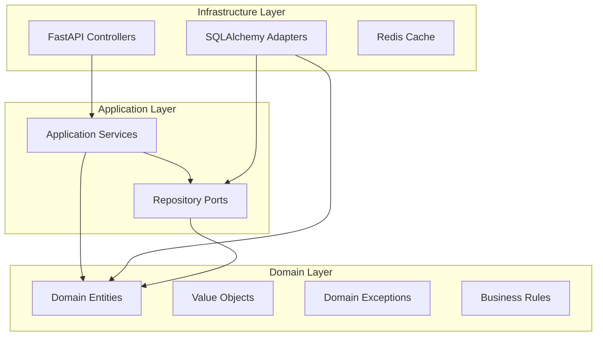
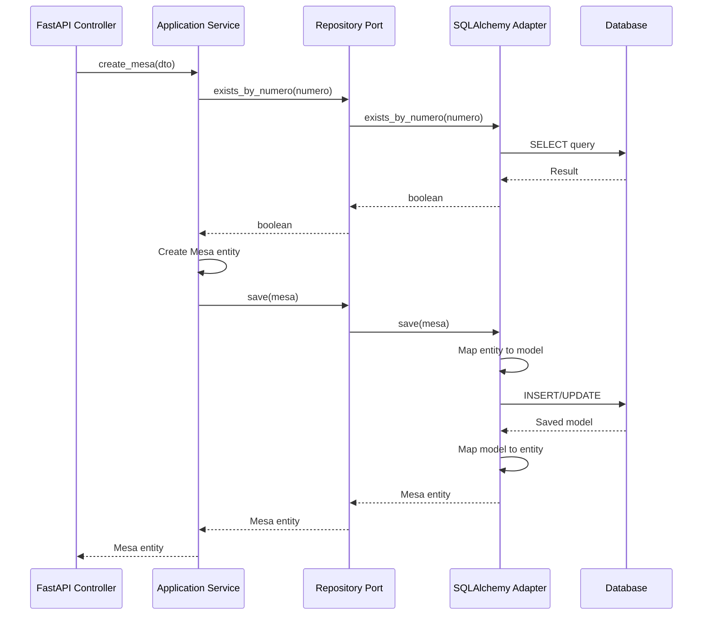

# Design Document

## Overview

This design document outlines the refactoring of the Menu and Carta module (Item, Ingrediente, Plato, Bebida) from a traditional layered architecture to a proper hexagonal architecture. The refactoring will separate the menu management system into three distinct layers: Domain (core menu business logic), Application (menu use cases and orchestration), and Infrastructure (external concerns like databases, web frameworks).

The key principle is that dependencies point inward - the domain layer has no dependencies, the application layer depends only on the domain, and the infrastructure layer depends on both domain and application layers.

## Architecture

### Hexagonal Architecture Layers



### Directory Structure

```
app/
├── domain/                    # Domain Layer (Core Menu Business Logic)
│   ├── entities/             # Pure menu business entities
│   │   ├── __init__.py
│   │   ├── item.py          # Item domain entity (base)
│   │   ├── ingrediente.py   # Ingrediente domain entity
│   │   ├── plato.py         # Plato domain entity
│   │   └── bebida.py        # Bebida domain entity
│   ├── value_objects/        # Menu value objects
│   │   ├── __init__.py
│   │   ├── etiqueta_item.py     # Item labels enum
│   │   ├── etiqueta_ingrediente.py # Ingredient labels enum
│   │   ├── etiqueta_plato.py    # Dish labels enum
│   │   ├── precio.py            # Price value object
│   │   └── informacion_nutricional.py # Nutritional info value object
│   ├── exceptions/           # Menu domain-specific exceptions
│   │   ├── __init__.py
│   │   └── menu_exceptions.py
│   └── repositories/         # Menu repository interfaces (ports)
│       ├── __init__.py
│       ├── item_repository.py
│       ├── ingrediente_repository.py
│       ├── plato_repository.py
│       └── bebida_repository.py
├── application/              # Application Layer (Menu Use Cases)
│   ├── services/            # Menu application services
│   │   ├── __init__.py
│   │   ├── menu_service.py
│   │   ├── item_service.py
│   │   └── ingrediente_service.py
│   └── dto/                 # Menu Data Transfer Objects
│       ├── __init__.py
│       ├── item_dto.py
│       ├── ingrediente_dto.py
│       ├── plato_dto.py
│       └── bebida_dto.py
├── infrastructure/           # Infrastructure Layer (External Concerns)
│   ├── persistence/         # Database adapters
│   │   ├── __init__.py
│   │   ├── models/         # SQLAlchemy models
│   │   │   ├── __init__.py
│   │   │   ├── base.py
│   │   │   ├── item_model.py
│   │   │   ├── ingrediente_model.py
│   │   │   ├── plato_model.py
│   │   │   └── bebida_model.py
│   │   ├── repositories/   # Repository implementations
│   │   │   ├── __init__.py
│   │   │   ├── sqlalchemy_item_repository.py
│   │   │   ├── sqlalchemy_ingrediente_repository.py
│   │   │   ├── sqlalchemy_plato_repository.py
│   │   │   └── sqlalchemy_bebida_repository.py
│   │   └── mappers/        # Entity-Model mappers
│   │       ├── __init__.py
│   │       ├── item_mapper.py
│   │       ├── ingrediente_mapper.py
│   │       ├── plato_mapper.py
│   │       └── bebida_mapper.py
│   ├── web/                # Web layer (FastAPI)
│   │   ├── __init__.py
│   │   ├── controllers/    # API controllers
│   │   │   ├── __init__.py
│   │   │   ├── menu_controller.py
│   │   │   └── item_controller.py
│   │   ├── schemas/        # API schemas
│   │   │   ├── __init__.py
│   │   │   ├── menu_schemas.py
│   │   │   └── item_schemas.py
│   │   └── dependencies/   # Dependency injection
│   │       ├── __init__.py
│   │       └── container.py
│   └── config/             # Configuration
│       ├── __init__.py
│       └── settings.py
```

## Components and Interfaces

### Domain Layer Components

#### 1. Mesa Entity (Pure Domain Object)

```python
# app/domain/entities/mesa.py
from dataclasses import dataclass
from typing import Optional
from uuid import UUID
from datetime import datetime

from app.domain.value_objects.mesa_numero import MesaNumero
from app.domain.value_objects.capacidad import Capacidad

@dataclass
class Mesa:
    """Pure domain entity for restaurant table."""
    
    id: UUID
    numero: MesaNumero
    nombre: str
    capacidad: Capacidad
    ubicacion: Optional[str]
    descripcion: Optional[str]
    activa: bool
    created_at: datetime
    updated_at: datetime
    version: int
    
    def activate(self) -> None:
        """Activate the table."""
        self.activa = True
    
    def deactivate(self) -> None:
        """Deactivate the table."""
        self.activa = False
    
    def update_capacity(self, new_capacity: Capacidad) -> None:
        """Update table capacity with business rules."""
        if new_capacity.value <= 0:
            raise ValueError("Capacity must be positive")
        self.capacidad = new_capacity
    
    def can_accommodate(self, party_size: int) -> bool:
        """Check if table can accommodate party size."""
        return self.activa and self.capacidad.value >= party_size
```

#### 2. Value Objects

```python
# app/domain/value_objects/mesa_numero.py
from dataclasses import dataclass

@dataclass(frozen=True)
class MesaNumero:
    """Value object for table number."""
    
    value: int
    
    def __post_init__(self):
        if self.value <= 0:
            raise ValueError("Table number must be positive")

# app/domain/value_objects/capacidad.py
from dataclasses import dataclass

@dataclass(frozen=True)
class Capacidad:
    """Value object for table capacity."""
    
    value: int
    
    def __post_init__(self):
        if self.value <= 0:
            raise ValueError("Capacity must be positive")
        if self.value > 50:  # Business rule
            raise ValueError("Capacity cannot exceed 50 people")
```

#### 3. Repository Port (Interface)

```python
# app/domain/repositories/mesa_repository.py
from abc import ABC, abstractmethod
from typing import List, Optional
from uuid import UUID

from app.domain.entities.mesa import Mesa
from app.domain.value_objects.mesa_numero import MesaNumero

class MesaRepositoryPort(ABC):
    """Repository interface for Mesa operations."""
    
    @abstractmethod
    async def get_by_id(self, mesa_id: UUID) -> Optional[Mesa]:
        """Get mesa by ID."""
        pass
    
    @abstractmethod
    async def get_by_numero(self, numero: MesaNumero) -> Optional[Mesa]:
        """Get mesa by table number."""
        pass
    
    @abstractmethod
    async def get_all_active(self) -> List[Mesa]:
        """Get all active mesas."""
        pass
    
    @abstractmethod
    async def get_by_capacity_range(self, min_capacity: int, max_capacity: int) -> List[Mesa]:
        """Get mesas by capacity range."""
        pass
    
    @abstractmethod
    async def save(self, mesa: Mesa) -> Mesa:
        """Save mesa (create or update)."""
        pass
    
    @abstractmethod
    async def delete(self, mesa_id: UUID) -> bool:
        """Delete mesa by ID."""
        pass
    
    @abstractmethod
    async def exists_by_numero(self, numero: MesaNumero) -> bool:
        """Check if mesa exists by number."""
        pass
```

### Application Layer Components

#### 1. Application Service

```python
# app/application/services/mesa_service.py
from typing import List, Optional
from uuid import UUID

from app.domain.entities.mesa import Mesa
from app.domain.repositories.mesa_repository import MesaRepositoryPort
from app.domain.value_objects.mesa_numero import MesaNumero
from app.domain.value_objects.capacidad import Capacidad
from app.domain.exceptions.mesa_exceptions import MesaNotFoundError, MesaAlreadyExistsError
from app.application.dto.mesa_dto import CreateMesaDTO, UpdateMesaDTO

class MesaApplicationService:
    """Application service for Mesa use cases."""
    
    def __init__(self, mesa_repository: MesaRepositoryPort):
        self._mesa_repository = mesa_repository
    
    async def create_mesa(self, create_dto: CreateMesaDTO) -> Mesa:
        """Create a new mesa."""
        numero = MesaNumero(create_dto.numero)
        
        # Business rule: Check if table number already exists
        if await self._mesa_repository.exists_by_numero(numero):
            raise MesaAlreadyExistsError(f"Mesa with number {numero.value} already exists")
        
        capacidad = Capacidad(create_dto.capacidad)
        
        mesa = Mesa(
            id=UUID(),
            numero=numero,
            nombre=create_dto.nombre,
            capacidad=capacidad,
            ubicacion=create_dto.ubicacion,
            descripcion=create_dto.descripcion,
            activa=True,
            created_at=datetime.utcnow(),
            updated_at=datetime.utcnow(),
            version=1
        )
        
        return await self._mesa_repository.save(mesa)
```

### Infrastructure Layer Components

#### 1. SQLAlchemy Model (Infrastructure)

```python
# app/infrastructure/persistence/models/mesa_model.py
from sqlalchemy import Column, String, Integer, Boolean, Text
from sqlalchemy.orm import relationship

from app.infrastructure.persistence.models.base import BaseModel

class MesaModel(BaseModel):
    """SQLAlchemy model for Mesa persistence."""
    
    __tablename__ = "mesas"
    
    numero = Column(Integer, unique=True, nullable=False, index=True)
    nombre = Column(String(100), nullable=False)
    capacidad = Column(Integer, nullable=False)
    ubicacion = Column(String(100))
    descripcion = Column(Text)
    activa = Column(Boolean, default=True, nullable=False)
```

#### 2. Repository Adapter

```python
# app/infrastructure/persistence/repositories/sqlalchemy_mesa_repository.py
from typing import List, Optional
from uuid import UUID
from sqlalchemy import select
from sqlalchemy.ext.asyncio import AsyncSession

from app.domain.entities.mesa import Mesa
from app.domain.repositories.mesa_repository import MesaRepositoryPort
from app.domain.value_objects.mesa_numero import MesaNumero
from app.infrastructure.persistence.models.mesa_model import MesaModel
from app.infrastructure.persistence.mappers.mesa_mapper import MesaMapper

class SqlAlchemyMesaRepository(MesaRepositoryPort):
    """SQLAlchemy implementation of Mesa repository."""
    
    def __init__(self, session: AsyncSession, mapper: MesaMapper):
        self._session = session
        self._mapper = mapper
    
    async def get_by_id(self, mesa_id: UUID) -> Optional[Mesa]:
        """Get mesa by ID."""
        result = await self._session.execute(
            select(MesaModel).where(MesaModel.id == mesa_id)
        )
        model = result.scalar_one_or_none()
        return self._mapper.to_entity(model) if model else None
    
    async def save(self, mesa: Mesa) -> Mesa:
        """Save mesa (create or update)."""
        model = self._mapper.to_model(mesa)
        self._session.add(model)
        await self._session.commit()
        await self._session.refresh(model)
        return self._mapper.to_entity(model)
```

#### 3. Entity-Model Mapper

```python
# app/infrastructure/persistence/mappers/mesa_mapper.py
from app.domain.entities.mesa import Mesa
from app.domain.value_objects.mesa_numero import MesaNumero
from app.domain.value_objects.capacidad import Capacidad
from app.infrastructure.persistence.models.mesa_model import MesaModel

class MesaMapper:
    """Mapper between Mesa entity and MesaModel."""
    
    def to_entity(self, model: MesaModel) -> Mesa:
        """Convert SQLAlchemy model to domain entity."""
        return Mesa(
            id=model.id,
            numero=MesaNumero(model.numero),
            nombre=model.nombre,
            capacidad=Capacidad(model.capacidad),
            ubicacion=model.ubicacion,
            descripcion=model.descripcion,
            activa=model.activa,
            created_at=model.created_at,
            updated_at=model.updated_at,
            version=model.version
        )
    
    def to_model(self, entity: Mesa) -> MesaModel:
        """Convert domain entity to SQLAlchemy model."""
        return MesaModel(
            id=entity.id,
            numero=entity.numero.value,
            nombre=entity.nombre,
            capacidad=entity.capacidad.value,
            ubicacion=entity.ubicacion,
            descripcion=entity.descripcion,
            activa=entity.activa,
            created_at=entity.created_at,
            updated_at=entity.updated_at,
            version=entity.version
        )
```

## Data Models

### Domain Entity Structure

The Mesa domain entity contains pure business logic without any infrastructure dependencies:

- **Identity**: UUID-based identification
- **Value Objects**: MesaNumero and Capacidad for type safety and validation
- **Business Methods**: activate(), deactivate(), can_accommodate()
- **Invariants**: Enforced through value objects and entity methods

### Data Flow



## Error Handling

### Domain Exceptions

```python
# app/domain/exceptions/mesa_exceptions.py
class MesaDomainException(Exception):
    """Base exception for Mesa domain."""
    pass

class MesaNotFoundError(MesaDomainException):
    """Raised when mesa is not found."""
    pass

class MesaAlreadyExistsError(MesaDomainException):
    """Raised when trying to create mesa with existing number."""
    pass

class InvalidCapacityError(MesaDomainException):
    """Raised when capacity is invalid."""
    pass
```

### Error Translation

Infrastructure adapters translate technical exceptions to domain exceptions at the boundary.

## Testing Strategy

### Unit Testing

1. **Domain Entities**: Test business logic in isolation
2. **Value Objects**: Test validation and immutability
3. **Application Services**: Test with mocked repository ports
4. **Repository Adapters**: Test with in-memory database

### Integration Testing

1. **API Endpoints**: Test complete request-response cycle
2. **Database Operations**: Test with test database
3. **Dependency Injection**: Test wiring of components

### Test Structure

```python
# tests/domain/entities/test_mesa.py
def test_mesa_can_accommodate():
    mesa = Mesa(...)
    assert mesa.can_accommodate(4) == True
    assert mesa.can_accommodate(10) == False

# tests/application/services/test_mesa_service.py
async def test_create_mesa_success(mock_repository):
    service = MesaApplicationService(mock_repository)
    # Test with mocked dependencies
```

## Migration Strategy

The refactoring will be implemented incrementally:

1. **Phase 1**: Create domain layer (entities, value objects, ports)
2. **Phase 2**: Implement infrastructure adapters
3. **Phase 3**: Refactor application services
4. **Phase 4**: Update API controllers
5. **Phase 5**: Remove old models and repositories
6. **Phase 6**: Update tests

Each phase maintains backward compatibility until the final cleanup.